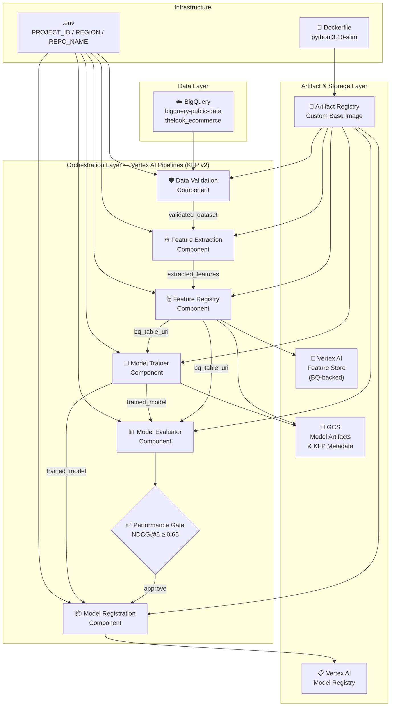
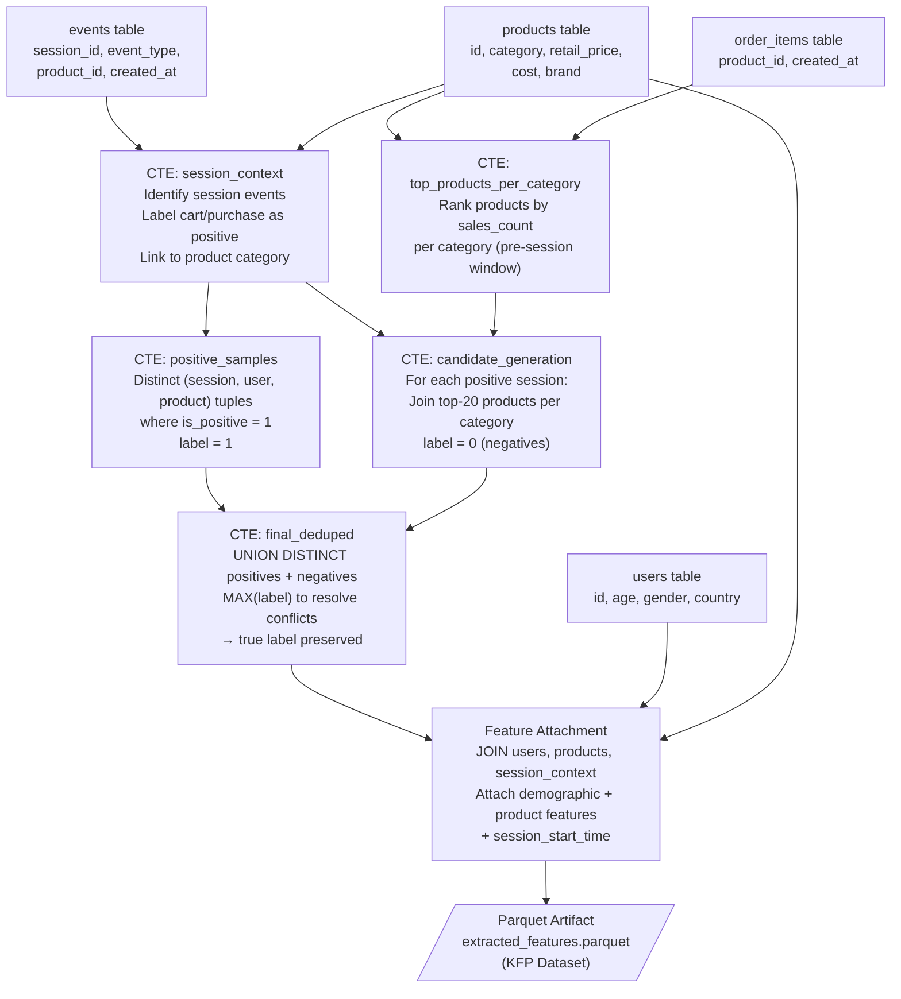
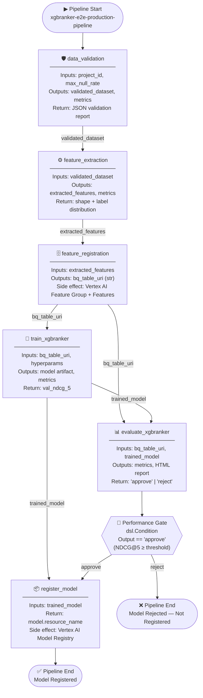

# 🚀 XGBRanker E2E MLOps Pipeline — Product Recommendation System


---

## ⚠️ Project Scope & Disclaimers

> **Please read carefully before using or referencing this project.**

1. **Educational & Experimental:** This project is built solely to demonstrate MLOps engineering skills, pipeline architecture design, and production-oriented thinking. It is **not** a finished commercial product.
2. **Not Stress-Tested:** The codebase has **not** been subjected to load testing, stress testing, or validation against a live production environment. Performance under real-world traffic is unknown.
3. **Not for Direct Production Use:** The system is presented as an architectural reference and learning artifact. It must **not** be deployed into a production environment as-is without a thorough security review, infra hardening, and testing cycle.
4. **Potential Bugs & Edge Cases:** The code may contain unhandled edge cases, incomplete error propagation, and latent bugs — particularly in areas like schema drift, BigQuery quota limits, and Feature Store consistency guarantees.
5. **Proof-of-Concept Components:** Several components (notably the Vertex AI Feature Store registration and the conditional deployment gate) are implemented as **PoC-level integrations** for learning and demonstration purposes.

---

## 📋 Table of Contents

- [Executive Summary](#-executive-summary--problem-statement)
- [System Architecture](#️-system-architecture--tech-stack)
- [Dataset & Data Processing](#-dataset--data-processing-lifecycle)
- [Feature Engineering](#️-feature-engineering-architecture)
- [MLOps Pipeline DAG](#-mlops-pipeline--dag-workflow)
- [Project Structure](#-project-structure)
- [Setup & Local Execution](#️-setup--local-execution)
- [Challenges & Limitations](#-challenges--limitations)
- [Future Improvements](#-future-improvements)

---

## 📊 Executive Summary & Problem Statement

### Vision

This project implements a **production-grade, end-to-end MLOps pipeline** for a **Learning-to-Rank (LTR) product recommendation system**. It demonstrates how to architect, build, and orchestrate a complete ML lifecycle — from raw data ingestion and validation through feature engineering, model training, automated evaluation, and conditional deployment — using a modern Google Cloud Platform stack.

### Business Problem

In e-commerce, the relevance of product recommendations directly drives conversion rates and revenue. A naïve collaborative filtering approach fails under two critical constraints:

- **Session-level context:** A user's in-session behavior (browsing category, current intent) is a stronger ranking signal than historical purchase patterns alone.
- **Candidate ranking quality:** Surfacing the top-*k* most relevant products from a large catalog requires a **pointwise-to-listwise** ranking model, not a simple binary classifier.

This pipeline addresses both constraints by implementing a **session-aware, Learning-to-Rank model** (`XGBRanker` with `rank:ndcg` objective) trained on behavioral event signals from the `thelook_ecommerce` dataset.

### High-Level MLOps Lifecycle

```
Raw BigQuery Data → Validation Gate → Feature Engineering
                                              ↓
                               Vertex AI Feature Store (BQ-backed)
                                              ↓
                               XGBRanker Training (Session-Grouped)
                                              ↓
                               NDCG@5 Evaluation Gate (≥ 0.65)
                                              ↓
                               Conditional Model Registration (Vertex AI)
```

All stages are orchestrated as a **Kubeflow Pipelines v2 (KFP) DAG** compiled to YAML and submitted to **Vertex AI Pipelines**.

---

## ⚙️ System Architecture & Tech Stack

### Architecture Diagram



### Tech Stack

| Layer | Technology | Version | Role |
|---|---|---|---|
| **Orchestration** | Kubeflow Pipelines (KFP) | 2.4.0 | DAG definition, component compilation, YAML export |
| **Compute Platform** | Vertex AI Pipelines | — | Managed KFP execution environment |
| **Data Warehouse** | Google BigQuery | 3.11.4 | Source data + Feature Store backend |
| **Feature Store** | Vertex AI Feature Store | 1.38.0 | Feature versioning, serving, group management |
| **Model Framework** | XGBoost / XGBRanker | 2.0.0 | Learning-to-Rank with `rank:ndcg` objective |
| **Containerization** | Docker | — | Custom base image for all KFP components |
| **Container Registry** | Artifact Registry | — | Stores versioned base images (`xgbranker-pipeline-base`) |
| **Model Registry** | Vertex AI Model Registry | — | Versioned model artifact storage & serving metadata |
| **Data Processing** | Pandas + PyArrow | 2.1.0 / 13.0.0 | In-component DataFrame handling & Parquet I/O |
| **Config Management** | Python Dataclasses + `.env` | — | Strongly-typed config hierarchy |
| **Evaluation** | scikit-learn `ndcg_score` | 1.3.0 | Session-grouped NDCG@5 computation |

---

## 🗄️ Dataset & Data Processing Lifecycle

### Data Flow Diagram

```mermaid
flowchart LR
    subgraph "Source: BigQuery Public Data"
        T1[("users")]
        T2[("products")]
        T3[("orders")]
        T4[("order_items")]
        T5[("events")]
        T6[("inventory_items")]
    end

    subgraph "Data Validation Component (11 Checks)"
        C1["✅ Missing Values"]
        C2["✅ Duplicate Records"]
        C3["✅ Negative Prices"]
        C4["✅ Invalid Ages"]
        C5["✅ Broken FK Relations"]
        C6["✅ Data Leakage"]
        C7["✅ Empty Product Names"]
        C8["✅ Invalid Product Prices"]
        C9["✅ Orders Without Items"]
        C10["✅ Schema Validation"]
        GATE{{"Validation Gate\nAll checks passed?"}}
    end

    subgraph "Outputs"
        P1[/"validated_dataset.parquet\n(KFP Dataset Artifact)"/]
        M1[["Vertex AI Metrics\n(null rate, duplicates,\nbroken relations)"]]]
    end

    T1 & T2 & T3 & T4 --> C1 & C2 & C3 & C4 & C5 & C6 & C7 & C8 & C9 & C10
    C1 & C2 & C3 & C4 & C5 & C6 & C7 & C8 & C9 & C10 --> GATE
    GATE -->|pass| P1
    GATE -->|fail| M1
    P1 --> M1
```

### Dataset Description

**Source:** `bigquery-public-data.thelook_ecommerce` (Google BigQuery Public Dataset)

This is a synthetic e-commerce dataset simulating a fashion retail platform with full transactional and behavioral event logs.

| Table | Key Columns | Row Estimate | Description |
|---|---|---|---|
| `users` | `id`, `age`, `gender`, `country` | ~100K | User demographic profile |
| `products` | `id`, `name`, `brand`, `category`, `retail_price`, `cost` | ~30K | Product catalog |
| `orders` | `order_id`, `user_id`, `created_at`, `status` | ~120K | Order headers |
| `order_items` | `id`, `order_id`, `user_id`, `product_id`, `sale_price`, `status` | ~250K | Line-item transactions |
| `events` | `session_id`, `user_id`, `event_type`, `product_id`, `created_at` | ~2.5M | Clickstream / behavioral events |
| `inventory_items` | `id`, `product_id`, `cost` | ~500K | Inventory with cost basis |

### Validation Check Inventory

| # | Check | Query Target | Failure Action |
|---|---|---|---|
| 1 | Missing Critical Values | `order_items` | Hard fail — blocks downstream |
| 2 | Duplicate Records | `order_items` | Hard fail |
| 3 | Negative Sale Prices | `order_items` | Hard fail |
| 4 | Invalid User Ages | `users` (age < 0 or > 100) | Hard fail |
| 5 | Broken Product FK | `order_items LEFT JOIN products` | Hard fail |
| 6 | Broken User FK | `order_items LEFT JOIN users` | Hard fail |
| 7 | Data Leakage (Future Dates) | `orders.created_at > NOW()` | Hard fail |
| 8 | Empty Product Names | `products.name IS NULL` | Hard fail |
| 9 | Invalid Product Prices | `retail_price <= 0 OR cost < 0` | Hard fail |
| 10 | Orders Without Items | `orders LEFT JOIN order_items` | Hard fail |
| 11 | Schema Type Validation | `INFORMATION_SCHEMA.COLUMNS` | Hard fail |

> **Technical Note:** The `max_null_rate` parameter is a pipeline-level runtime argument, allowing operators to configure acceptable null tolerance without recompiling the pipeline.

---

## 🛠️ Feature Engineering Architecture

### Feature Engineering Flow



### Feature Table

| Feature | Type | Source CTE / Table | Engineering Logic | Rationale |
|---|---|---|---|---|
| `qid` | INTEGER | `session_context` | `session_id` aliased as group key | XGBRanker requires a group/query ID to define ranking partitions |
| `user_id` | INTEGER | `users` | Raw join key | Identity; excluded from model features (in `ignore_columns`) |
| `product_id` | INTEGER | `products` | Raw join key | Identity; excluded from model features |
| `user_age` | INTEGER | `users.age` | Direct join | Demographic proxy for purchase intent and product affinity |
| `user_gender` | CATEGORY | `users.gender` | Direct join + encoded as `category` dtype | Categorical signal for style/product segment preference |
| `user_country` | CATEGORY | `users.country` | Direct join + encoded as `category` dtype | Geographic market signal; proxy for currency, brand availability |
| `retail_price` | FLOAT | `products.retail_price` | Direct join | Absolute price point; high-cardinality continuous signal |
| `cost` | FLOAT | `products.cost` | Direct join | Margin context; models can implicitly learn price elasticity |
| `profit_margin` | FLOAT | Derived | `retail_price - cost` | Engineered feature capturing product-level profitability; useful for business-aligned ranking |
| `brand` | CATEGORY | `products.brand` | Direct join + encoded as `category` dtype | Brand loyalty and familiarity are strong purchase-intent signals |
| `target_label` | BINARY INT | `session_context` | `MAX(is_positive)` per `(session, product)` | 1 = user performed a `cart` or `purchase` event; 0 = candidate shown but no action |
| `session_start_time` | TIMESTAMP | `session_context` | `MIN(created_at)` per `session_id` | Used for temporal ordering before training split; **excluded from features** |

> **Interaction Weighting:** The `config/feature_config.py` defines a full interaction weight map (`purchase: 5.0`, `cart: 3.0`, `product: 1.0`, `cancel: -1.0`, etc.). In the current PoC, only binary labeling (`cart`/`purchase` = 1) is implemented. Weighted relevance scoring is a planned v2 enhancement.

> **Candidate Strategy:** For each positive (session, product) pair, the top-20 products in the same category by historical sales are injected as negative candidates. This simulates a realistic listwise ranking scenario where the model must distinguish the relevant item from plausible alternatives.

---

## 🔄 MLOps Pipeline & DAG Workflow

### End-to-End Pipeline DAG



### Component Descriptions

**`data_validation`**

Executes 11 SQL-based data quality checks against the raw BigQuery source. Uses a parameterized `max_null_rate` threshold to allow runtime tolerance configuration. On success, exports a cleaned `validated_dataset` Parquet artifact. All check results, error messages, and counts are serialized to a structured JSON return value. Key metrics (null counts, duplicate counts, broken relation totals, validation status) are logged to Vertex AI Metrics for pipeline run tracking.

**`feature_extraction`**

Assembles and executes a multi-CTE BigQuery SQL query to construct the training dataset. The query performs session identification, positive label assignment (cart/purchase events), candidate negative generation (top-20 products per category), deduplication via `UNION DISTINCT + MAX(label)`, and feature attachment via joins to `users` and `products`. Categorical columns are encoded as `category` dtype for XGBoost's native categorical support. Outputs a Parquet artifact with sample count, feature count, and label distribution metrics.

**`feature_registration`**

Uploads the extracted feature DataFrame to a BigQuery destination table (`WRITE_TRUNCATE`). Then initializes or retrieves a Vertex AI Feature Group backed by the BQ table and iterates over all non-ID columns to register individual features. Returns the `bq://` URI of the registered table, which is consumed by both the training and evaluation components. This design decouples feature computation from feature serving.

**`train_xgbranker`**

Loads training data from BigQuery via the registered feature table URI, performs temporal group-based train/validation split (80/20 by unique `qid`), and trains an `XGBRanker` with `rank:ndcg` objective. Supports runtime hyperparameter overrides (`n_estimators`, `learning_rate`, `max_depth`). Uses early stopping (15 rounds) monitored on `ndcg@5` and `ndcg@10`. The best iteration's `val_ndcg_5` is logged to Vertex AI Metrics. The model artifact is saved to GCS via KFP's `Output[Model]` artifact mechanism.

**`evaluate_xgbranker`**

Loads the held-out test split from BigQuery and the trained model artifact from GCS. Computes per-session `ndcg_score` (k=5) using `sklearn.metrics.ndcg_score` across all sessions with at least one positive label. Aggregates to a `mean_ndcg_5` scalar. Compares against the configurable threshold (default 0.65) and returns `"approve"` or `"reject"`. Generates a styled HTML evaluation report artifact visible in the Vertex AI Pipelines UI.

**`register_model` (Conditional)**

Executes only when the evaluation gate returns `"approve"`. Uploads the model artifact directory to Vertex AI Model Registry using `aiplatform.Model.upload()` with the XGBoost CPU serving container (`us-docker.pkg.dev/vertex-ai/prediction/xgboost-cpu.1-7:latest`). Supports a `model_display_name_override` parameter for pipeline-level naming without code changes. Returns the full Vertex AI model resource name.

---

## 📁 Project Structure

```
xgbranker-mlops-pipeline/
│
├── Dockerfile                          # Base image definition (python:3.10-slim)
├── requirements.txt                    # Pinned Python dependencies
├── full_pipeline.py                    # Pipeline definition + KFP compiler entrypoint
│
├── config/
│   ├── model_config.py                 # Typed config: features, hyperparams, evaluation, deployment
│   └── feature_config.py               # BQ project/dataset refs, table names, interaction weights
│
└── src/
    ├── components/
    │   ├── data_validation.py          # KFP component: 11-check data quality gate
    │   ├── model_trainer.py            # KFP component: XGBRanker training
    │   ├── model_evaluation.py         # KFP component: NDCG@5 evaluation + HTML report
    │   └── model_registration.py       # KFP component: Vertex AI Model Registry upload
    │
    ├── features/
    │   └── Feature_extraction.py       # KFP component: BigQuery CTE feature assembly
    │
    ├── feature_store/
    │   └── feature_registry.py         # KFP component: BQ upload + Vertex AI Feature Group
    │
    ├── queries/
    │   ├── feature_queries.py          # SQL CTE definitions for feature engineering
    │   └── Querys_for_validation.py    # SQL queries for all 11 validation checks
    │
    └── utils/
        └── bq_utils.py                 # BigQueryManager: query→DataFrame, DataFrame→table, DDL, exists
```

---

## 🖥️ Setup & Local Execution

### Prerequisites

- Python 3.10+
- Docker (for building the base image)
- Google Cloud SDK (`gcloud`) authenticated with Application Default Credentials
- A GCP project with the following APIs enabled:
  - Vertex AI API
  - BigQuery API
  - Artifact Registry API
  - Cloud Storage API

### 1. Clone the Repository

```bash
git clone https://github.com/<your-org>/xgbranker-mlops-pipeline.git
cd xgbranker-mlops-pipeline
```

### 2. Create & Activate Virtual Environment

```bash
python3.10 -m venv .venv
source .venv/bin/activate   # Linux/macOS
# .venv\Scripts\activate    # Windows
```

### 3. Install Dependencies

```bash
pip install --upgrade pip
pip install -r requirements.txt
```

### 4. Configure Environment Variables

Create a `.env` file in the project root:

```bash
cp .env.example .env
```

Edit `.env` with your GCP values:

```dotenv
PROJECT_ID=your-gcp-project-id
REGION=us-central1
REPO_NAME=your-artifact-registry-repo-name
```

### 5. Build & Push the Custom Base Image

> **Note:** All KFP components use a shared custom Docker base image. It must be pushed to Artifact Registry before the pipeline can run.

```bash
# Authenticate Docker to Artifact Registry
gcloud auth configure-docker ${REGION}-docker.pkg.dev

# Build the base image
docker build -t ${REGION}-docker.pkg.dev/${PROJECT_ID}/${REPO_NAME}/xgbranker-pipeline-base:latest .

# Push to Artifact Registry
docker push ${REGION}-docker.pkg.dev/${PROJECT_ID}/${REPO_NAME}/xgbranker-pipeline-base:latest
```

### 6. Compile the Pipeline

```bash
python full_pipeline.py
```

This outputs `xgbranker_production_pipeline.yaml` in the project root — the compiled KFP pipeline definition.

### 7. Submit to Vertex AI Pipelines

```python
from google.cloud import aiplatform

aiplatform.init(project="your-gcp-project-id", location="us-central1")

job = aiplatform.PipelineJob(
    display_name="xgbranker-run-001",
    template_path="xgbranker_production_pipeline.yaml",
    parameter_values={
        "project_id": "your-gcp-project-id",
        "region": "us-central1",
        "bq_dataset_name": "recommendation_feature_store",
        "feature_group_name": "product_ranking_features",
        "max_null_rate": 100,
        "n_estimators": 150,
        "learning_rate": 0.1,
        "max_depth": 5,
        "ndcg_5_threshold": 0.65,
        "model_display_name": "xgbranker-product-recommendation",
    },
)

job.submit()
```

---

## 🚧 Challenges & Limitations

**1. Negative Candidate Quality**
The candidate generation strategy uses a static top-20-per-category heuristic. This introduces selection bias: the model only learns to rank within category-homogeneous candidate sets. Cross-category ranking (e.g., a user pivoting from Electronics to Accessories mid-session) is not represented in the training data.

**2. Temporal Data Leakage in Feature Joins**
The `top_products_per_category` CTE references `oi.created_at < sc.session_start_time` to enforce temporal integrity. However, the `Feature Attachment` CTE joins product metadata (e.g., `retail_price`, `cost`) as point-in-time values. If prices change over time, the current join reflects the latest price — not the price at session time — which constitutes a subtle form of leakage.

**3. Feature Store Synchronization Latency**
Vertex AI Feature Store online serving has an ingestion latency that is not accounted for in the current pipeline. The `feature_registration` component writes to BQ and registers the Feature Group, but there is no explicit wait or health-check before the training component reads from the same BQ table URI. Under high ingestion load, the training read could race the write.

**4. Stateless BigQueryManager Timeout Handling**
The `BigQueryManager.Query_To_Dataframe()` method applies a uniform 300-second timeout. For large feature extraction queries on the full `thelook_ecommerce` dataset, this may be insufficient. There is no retry logic or exponential backoff implemented.

**5. Hard-coded Evaluation Split**
The train/validation split is temporal (ordered by `session_start_time`) but the test set used in `evaluate_xgbranker` reads from the same BQ table as the training set. True held-out evaluation would require a separate, immutable test partition materialized at pipeline definition time — not at evaluation time.

**6. No Hyperparameter Optimization**
The current pipeline uses fixed hyperparameters passed at runtime. There is no integration with Vertex AI Vizier, Optuna, or any HPO framework, meaning the reported NDCG@5 is unlikely to be at the model's true optimum.

---

## 🔭 Future Improvements

- **Weighted Relevance Labels:** Activate the `INTERACTION_WEIGHTS` config (`purchase: 5.0`, `cart: 3.0`, `cancel: -1.0`) to replace binary labels with graded relevance scores, unlocking `rank:map` and `rank:pairwise` objectives for richer training signal.

- **Advanced Candidate Generation:** Replace the category-based top-20 heuristic with a two-tower ANN (Approximate Nearest Neighbor) retrieval model (e.g., using Vertex AI Matching Engine) to generate semantically diverse, cross-category candidates.

- **Rolling Window Features:** Implement the `ROLLING_WINDOWS: [7, 30, 90, 365]` config to engineer time-decay user interaction counts (e.g., `user_purchases_last_30d`, `product_views_last_7d`), adding temporal dynamics to the feature set.

- **Hyperparameter Optimization:** Integrate Vertex AI Vizier or Optuna with a dedicated HPO pipeline stage that runs parallel `train_xgbranker` trials and passes the best config to the main pipeline.

- **Feature Drift Monitoring:** Add a post-registration component that computes PSI (Population Stability Index) and feature distribution statistics between the current and previous feature versions, alerting on significant drift.

- **Online Serving Endpoint:** Add a `deploy_model` component downstream of `register_model` that creates a Vertex AI Endpoint and deploys the registered model, enabling real-time serving with `predict()`.

- **CI/CD Pipeline Integration:** Add GitHub Actions workflows for automated pipeline compilation, Docker image build/push, and pipeline submission on merge to `main`, completing the GitOps loop.

- **True Test Set Isolation:** Materialize a time-partitioned holdout test set in a separate BigQuery table at the start of each pipeline run, ensuring strict temporal separation between train, validation, and test splits.

- **Separate Configuration Files Per Environment:** Introduce `config/dev.yaml`, `config/staging.yaml`, and `config/prod.yaml` with environment-specific BQ dataset names, thresholds, and serving container URIs to support multi-environment deployments.

- **Structured Logging & Alerting:** Replace `print()` and basic `logging` calls with structured JSON logs forwarded to Cloud Logging, with Cloud Monitoring alerts on validation failures and model rejections.

---

*Built with ☁️ Google Cloud Platform · 🤖 XGBoost · ⚙️ Kubeflow Pipelines v2*
