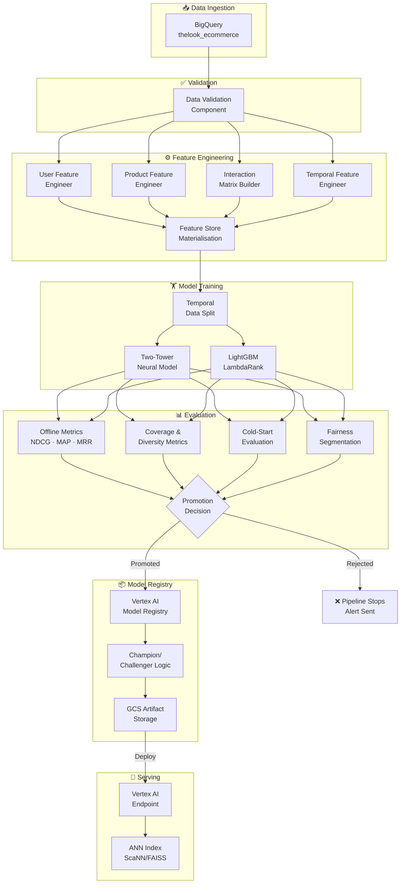
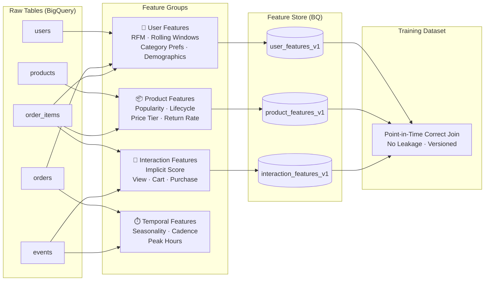
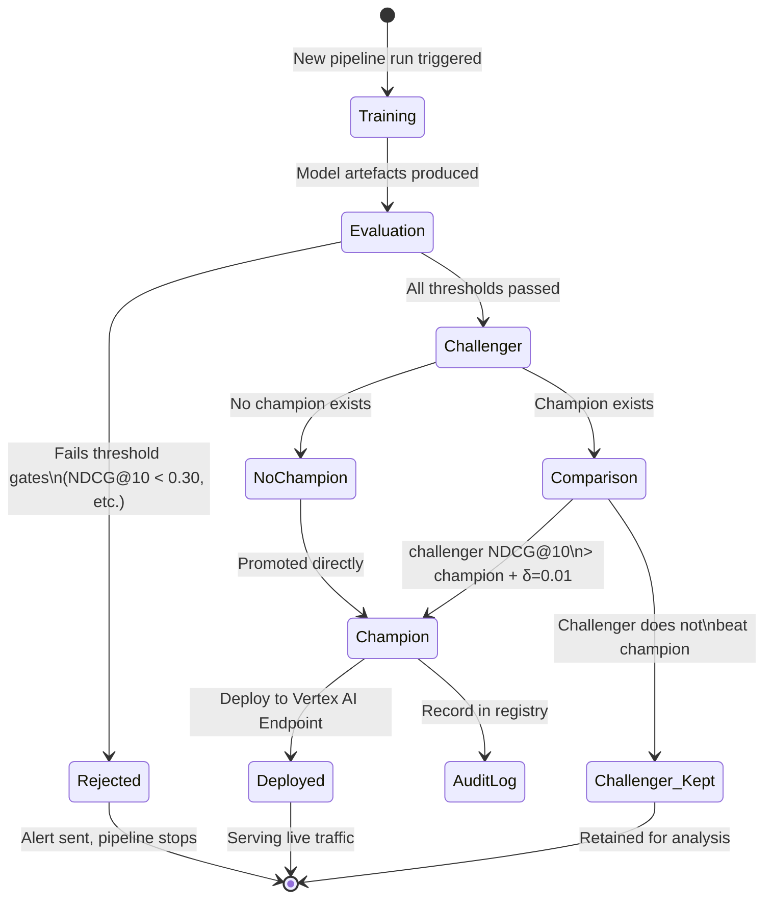
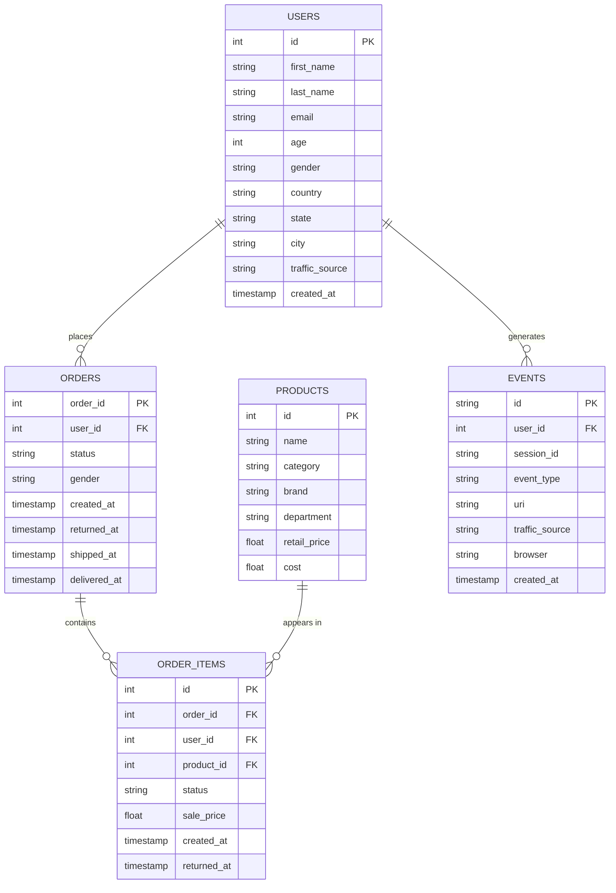

<div align="center">

#  TheLook Ecommerce — Production Recommendation System

### A Full-Scale MLOps Platform for Personalised Product Recommendations

[](https://python.org)
[](https://tensorflow.org)
[](https://lightgbm.readthedocs.io)
[](https://cloud.google.com/bigquery)
[](https://cloud.google.com/vertex-ai)
[](https://www.kubeflow.org)
[](https://docker.com)
[](https://github.com/features/actions)
[](LICENSE)

---

*A complete, end-to-end recommendation system built to production standards — featuring a Two-Tower neural retrieval model, LightGBM LambdaRank re-ranker, BigQuery offline Feature Store, Vertex AI pipeline orchestration, Champion/Challenger model governance, and full CI/CD automation.*

</div>

---

## Table of Contents

1. [Project Overview](#1-project-overview)
2. [Key Features](#2-key-features)
3. [System Architecture](#3-system-architecture)
4. [Project Structure](#4-project-structure)
5. [Technology Stack](#5-technology-stack)
6. [Dataset Description](#6-dataset-description)
7. [Feature Engineering](#7-feature-engineering)
8. [Feature Store Design](#8-feature-store-design)
9. [ML Pipeline](#9-ml-pipeline)
10. [Vertex AI & Kubeflow Pipelines](#10-vertex-ai--kubeflow-pipelines)
11. [Model Training](#11-model-training)
12. [Model Evaluation](#12-model-evaluation)
13. [Recommendation Generation](#13-recommendation-generation)
14. [Monitoring & Observability](#14-monitoring--observability)
15. [Docker & Containerisation](#15-docker--containerisation)
16. [CI/CD Pipeline](#16-cicd-pipeline)
17. [Infrastructure & Cloud Architecture](#17-infrastructure--cloud-architecture)
18. [Installation Guide](#18-installation-guide)
19. [Usage Examples](#19-usage-examples)
20. [Future Improvements](#20-future-improvements)
21. [Lessons Learned](#21-lessons-learned)
22. [Contributors](#22-contributors)
23. [License](#23-license)

---

## 1. Project Overview

### What This System Does

This repository implements a **full-stack, production-grade personalised recommendation system** for an e-commerce platform, built on top of the publicly available [BigQuery TheLook Ecommerce dataset](https://console.cloud.google.com/marketplace/product/bigquery-public-data/thelook-ecommerce). The system ingests raw transactional and behavioural data, transforms it into a rich feature representation, trains a two-stage neural + gradient-boosted ranking model, evaluates it against a comprehensive offline metric suite, registers versioned model artefacts in a governed model registry, and exposes recommendations via a Vertex AI endpoint.

The entire workflow — from raw data in BigQuery to a live recommendation API — is orchestrated as a reproducible, parameterised, multi-component **Kubeflow Pipeline v2** running on **Vertex AI Pipelines**, and is automatically re-executed on every code merge via **GitHub Actions CI/CD**.

### The Business Problem

In modern e-commerce, the average product catalogue contains tens of thousands of SKUs. A user visiting the homepage or a product page is confronted with choice paralysis: without intelligent guidance, they will either bounce or purchase the first adequate result, leaving significant revenue on the table.

Personalised recommendations address this problem by learning each user's latent preferences from their historical interactions and surfacing the most relevant subset of the catalogue at the right moment. Industry benchmarks consistently show that effective recommendation systems drive **25–40% of total revenue** at scale (Amazon attributes approximately 35% of its revenue to its recommendation engine).

The specific business goals this system targets:

| Business Goal | ML Formulation | Primary Metric |
|---|---|---|
| Increase click-through rate | Ranking relevant items higher | NDCG@10 |
| Improve conversion rate | Retrieve items likely to be purchased | Recall@10 |
| Reduce catalogue blind spots | Recommend a diverse range of products | Catalogue Coverage |
| Serve new users effectively | Cold-start handling via content features | Cold-Start NDCG@10 |
| Prevent bad recommendations | Filter returned items | Return-rate-adjusted ranking |

### Why Recommendation Systems Are Hard

A naive recommendation system — "show the most popular items" — is easy to build but fails on three fundamental axes:

1. **Personalisation**: Every user has a unique preference profile. A parent buying children's clothing has fundamentally different needs from a college student shopping for sportswear, even if both are "active" users with similar spending levels.

2. **Sparsity**: User-item interaction matrices are typically 99.9%+ sparse. Most users have interacted with a vanishingly small fraction of the catalogue, making direct collaborative filtering unreliable.

3. **Scale**: With 100,000 users and 50,000 products, evaluating every (user, product) pair at serving time is computationally infeasible. The system must retrieve a small candidate set quickly and then rank it with a high-quality model.

This system addresses all three challenges through its two-stage architecture:
- **Stage 1 — Two-Tower Retrieval**: A neural model that maps users and products into the same embedding space, enabling fast Approximate Nearest Neighbour (ANN) search to retrieve 100 candidates per user in milliseconds.
- **Stage 2 — LightGBM Re-Ranker**: A gradient-boosted tree with LambdaRank objective that uses rich cross-features to score and order the 100 candidates, directly optimising NDCG.

---

## 2. Key Features

<table>
<tr>
<th>Category</th>
<th>Capability</th>
<th>Engineering Details</th>
</tr>
<tr>
<td><b>Data Layer</b></td>
<td>Automated data validation</td>
<td>9-point quality check suite: null rates, duplicates, negative prices, referential integrity, schema drift, data leakage detection</td>
</tr>
<tr>
<td><b>Feature Engineering</b></td>
<td>40+ production features</td>
<td>User RFM scores, rolling windows (7/30/90/365d), category preferences, product lifecycle stages, implicit interaction signals, temporal patterns</td>
</tr>
<tr>
<td><b>Feature Store</b></td>
<td>BigQuery offline store with Point-in-Time correctness</td>
<td>Partitioned + clustered BQ tables, feature versioning, freshness SLAs, online/offline consistency, cold-start defaults via Feature Registry</td>
</tr>
<tr>
<td><b>Retrieval Model</b></td>
<td>Two-Tower neural network</td>
<td>Separate user/product towers with embedding layers, batch normalisation, dropout regularisation, in-batch softmax (InfoNCE) loss</td>
</tr>
<tr>
<td><b>Ranking Model</b></td>
<td>LightGBM LambdaRank</td>
<td>Directly optimises NDCG, graded relevance labels, cross-feature engineering (price affinity, category alignment), SHAP explainability</td>
</tr>
<tr>
<td><b>Evaluation</b></td>
<td>Comprehensive offline metric suite</td>
<td>NDCG@K, MAP@K, MRR, P@K, R@K, HR@K, catalogue coverage, intra-list diversity, novelty, popular-item bias, cold-start evaluation, fairness segmentation</td>
</tr>
<tr>
<td><b>Model Governance</b></td>
<td>Champion/Challenger promotion</td>
<td>Automatic comparison against current champion, configurable improvement delta, degradation tolerance, full audit log, one-command rollback</td>
</tr>
<tr>
<td><b>Pipeline Orchestration</b></td>
<td>Vertex AI Kubeflow Pipeline v2</td>
<td>6-stage DAG, conditional branching (deploy if promoted), per-component resource limits, retry policies, artifact lineage, pipeline caching</td>
</tr>
<tr>
<td><b>Model Registry</b></td>
<td>Vertex AI Model Registry</td>
<td>Immutable version records with full lineage (git SHA, pipeline run ID, feature version, training dataset ref), GCS artifact storage</td>
</tr>
<tr>
<td><b>Serving</b></td>
<td>Vertex AI Endpoint</td>
<td>Auto-scaling (1–5 replicas), 100% traffic routing to champion, version-labelled deployments</td>
</tr>
<tr>
<td><b>Reproducibility</b></td>
<td>Fully parameterised pipelines</td>
<td>Every run is uniquely identified, all inputs/outputs are tracked as KFP artifacts, identical parameters produce identical results</td>
</tr>
<tr>
<td><b>CI/CD</b></td>
<td>GitHub Actions automation</td>
<td>Lint → unit test → integration test → pipeline compile → container build → push → deploy on every PR merge to main</td>
</tr>
</table>

---

## 3. System Architecture

### High-Level Data Flow

The system is organised into five logical layers, each with clear boundaries and contracts:

```
┌─────────────────────────────────────────────────────────────────────────────┐
│  LAYER 1 — DATA LAYER                                                       │
│  BigQuery Public Dataset: bigquery-public-data.thelook_ecommerce            │
│  Tables: users · products · orders · order_items · events · inventory      │
└────────────────────────────────┬────────────────────────────────────────────┘
                                 │ SQL queries (validated + filtered)
┌────────────────────────────────▼────────────────────────────────────────────┐
│  LAYER 2 — FEATURE LAYER                                                    │
│  BigQuery Feature Store (project.recommendation_feature_store)              │
│  user_features_v1 · product_features_v1 · interaction_features_v1           │
│  Partitioned by DATE(feature_timestamp) · Clustered by entity_id            │
└────────────────────────────────┬────────────────────────────────────────────┘
                                 │ Point-in-Time correct join
┌────────────────────────────────▼────────────────────────────────────────────┐
│  LAYER 3 — TRAINING LAYER                                                   │
│  Temporal Split (75/10/15%) → LightGBM LambdaRank + TF Two-Tower           │
│  Outputs: ranking_model.txt · user_tower SavedModel · product_tower        │
└────────────────────────────────┬────────────────────────────────────────────┘
                                 │ Evaluation → Promotion Decision
┌────────────────────────────────▼────────────────────────────────────────────┐
│  LAYER 4 — REGISTRY LAYER                                                   │
│  Vertex AI Model Registry: version record + GCS artifact URI                │
│  Champion alias → currently serving model                                  │
│  Challenger alias → latest evaluated model                                 │
└────────────────────────────────┬────────────────────────────────────────────┘
                                 │ Deploy on promotion
┌────────────────────────────────▼────────────────────────────────────────────┐
│  LAYER 5 — SERVING LAYER                                                    │
│  Vertex AI Endpoint: thelook-recommender-endpoint                           │
│  ANN Index (ScaNN/FAISS) + LightGBM Ranker → top-K recommendations        │
└─────────────────────────────────────────────────────────────────────────────┘
```

### End-to-End Pipeline DAG



### Feature Engineering Architecture



### Champion/Challenger Model Governance



---

## 4. Project Structure

The repository follows a **domain-driven layout** where each top-level `src/` subdirectory owns exactly one concern in the ML lifecycle. This separation makes it possible for multiple engineers to work simultaneously on different pipeline stages without merge conflicts, and makes each component independently testable.

```
recommendation_system/
│
├── 📄 README.md                        ← This file
├── 📄 Dockerfile                       ← Production container image
├── 📄 docker-compose.yml               ← Local development stack
├── 📄 Makefile                         ← All common commands in one place
├── 📄 pyproject.toml                   ← Modern Python packaging + linting config
├── 📄 requirements.txt                 ← Pinned runtime dependencies
├── 📄 requirements-dev.txt             ← Dev/test dependencies
├── 📄 bootstrap.py                     ← Full project scaffold generator
├── 📄 .env.example                     ← Environment variable template
├── 📄 .gitignore                       ← Git exclusion rules
│
├── ⚙️  config/
│   ├── config.py                       ← DataConfig re-export (backward compat)
│   ├── feature_config.py               ← Feature Store settings, table references,
│   │                                      interaction weights, rolling window sizes
│   └── model_config.py                 ← TwoTowerConfig, RankingConfig,
│                                          EvaluationConfig, RegistryConfig
│
├── 🧠 src/
│   │
│   ├── utils/
│   │   └── bq_utils.py                 ← BigQueryManager: query→DataFrame,
│   │                                      DataFrame→BQ table, DDL execution
│   │
│   ├── queries/
│   │   ├── Querys.py                   ← Data validation queries (original)
│   │   └── feature_queries.py          ← All feature engineering SQL:
│   │                                      UserFeatureQueries, ProductFeatureQueries,
│   │                                      InteractionFeatureQueries,
│   │                                      TemporalFeatureQueries, FeatureStoreQueries
│   │
│   ├── features/
│   │   ├── user_features.py            ← UserFeatureEngineer: 25+ user-level features
│   │   ├── product_features.py         ← ProductFeatureEngineer: 20+ product features
│   │   ├── interaction_temporal_features.py  ← Implicit feedback matrix, session
│   │   │                                        features, negative signals, seasonality
│   │   └── feature_pipeline.py         ← KFP component: feature_engineering_pipeline
│   │                                      Orchestrates all feature groups
│   │
│   ├── feature_store/
│   │   ├── feature_registry.py         ← 40+ FeatureDefinition records with metadata:
│   │   │                                  entity, dtype, freshness SLA, online flag,
│   │   │                                  default values for cold-start
│   │   └── feature_store.py            ← FeatureStore: offline materialisation,
│   │                                      PiT-correct training dataset builder,
│   │                                      online feature serving interface,
│   │                                      feature schema validation
│   │
│   ├── models/
│   │   ├── two_tower_model.py          ← TF/Keras Two-Tower architecture:
│   │   │                                  _build_tower(), TwoTowerModel class,
│   │   │                                  batch softmax loss, Recall@K metric,
│   │   │                                  SavedModel serialisation
│   │   └── ranking_model.py            ← LightGBM LambdaRank:
│   │                                      build_graded_labels(), RankingModel class,
│   │                                      cross-feature engineering,
│   │                                      SHAP explainability, predict_top_k()
│   │
│   ├── training/
│   │   └── model_trainer.py            ← TemporalDataSplitter (75/10/15 PiT split),
│   │                                      TwoTowerTrainer (tf.data pipeline + vocab),
│   │                                      RankingTrainer (candidate generation),
│   │                                      KFP component: model_training_component
│   │
│   ├── evaluation/
│   │   └── model_evaluator.py          ← All metric functions (from scratch),
│   │                                      ModelEvaluator (full + cold-start + segment),
│   │                                      EvaluationResult + promotion gate,
│   │                                      KFP component: model_evaluation_component
│   │
│   ├── registration/
│   │   └── model_registry.py           ← ModelVersion (lineage record),
│   │                                      ChampionChallengerComparator,
│   │                                      ModelRegistry (Vertex AI + GCS + audit log),
│   │                                      KFP component: model_registration_component
│   │
│   └── pipeline/
│       └── full_pipeline.py            ← 6-stage KFP @pipeline definition,
│                                          data_validation_component (inline),
│                                          deploy_to_endpoint_component,
│                                          PipelineRunner (compile + submit + CLI)
│
├── 🧪 tests/
│   ├── unit/
│   │   ├── test_user_features.py
│   │   ├── test_product_features.py
│   │   ├── test_interaction_features.py
│   │   ├── test_evaluator_metrics.py
│   │   └── test_champion_challenger.py
│   ├── integration/
│   │   ├── test_bq_utils.py
│   │   └── test_feature_store.py
│   └── conftest.py
│
├── 📓 notebooks/
│   ├── 01_EDA.ipynb                    ← Exploratory data analysis
│   ├── 02_Feature_Analysis.ipynb       ← Feature distribution + importance
│   ├── 03_Model_Experiments.ipynb      ← Rapid prototyping
│   └── 04_Evaluation_Analysis.ipynb    ← Deep-dive into evaluation results
│
├── 📊 monitoring/
│   ├── data_drift.py                   ← Population Stability Index (PSI)
│   ├── model_drift.py                  ← NDCG rolling window monitoring
│   └── alerts.py                       ← Cloud Monitoring alert policies
│
├── 🔧 infrastructure/
│   ├── terraform/                      ← GCP resource provisioning
│   └── scripts/
│       ├── create_bq_dataset.sh
│       └── create_gcs_buckets.sh
│
└── 🚀 .github/
    └── workflows/
        ├── ci.yml                      ← PR: lint + unit tests + compile pipeline
        └── cd.yml                      ← Main merge: build + push + submit pipeline
```

### Why This Structure?

| Design Decision | Rationale |
|---|---|
| `src/` contains all Python packages | Prevents accidental top-level imports; forces proper package installation |
| One class per responsibility | `UserFeatureEngineer` knows nothing about models; `ModelEvaluator` knows nothing about BigQuery — each can be tested and replaced independently |
| SQL in `queries/` not inline | SQL queries are first-class artefacts that need versioning, review, and testing separate from Python logic |
| `config/` centralises all constants | No magic numbers scattered across files; changing a table name or threshold requires editing one file |
| KFP components mirror module structure | Each `src/x/x.py` module exposes both a `class X` (for unit testing) and a `@dsl.component` (for pipeline use) |
| `tests/unit` vs `tests/integration` | Unit tests run on every commit with no GCP credentials; integration tests run only in CI with service account access |

---

## 5. Technology Stack

| Technology | Version | Role | Why Chosen |
|---|---|---|---|
| **Python** | 3.10 | Primary language | Ecosystem dominance for ML; type hints + dataclasses enable production-grade code |
| **BigQuery** | Managed | Data warehouse + feature store | Serverless; handles petabyte-scale SQL; native partitioning + clustering for feature tables |
| **Vertex AI Pipelines** | 1.38 | Pipeline orchestration | Fully managed KFP v2 on GCP; eliminates cluster management; native Vertex AI integration |
| **Kubeflow Pipelines v2** | 2.4 | Pipeline DSL | Component-based DAG definition; artifact lineage; caching; portable across environments |
| **TensorFlow / Keras** | 2.13 | Two-Tower neural model | Flexible custom training loops; SavedModel format; Vertex AI serving compatibility |
| **LightGBM** | 4.1 | LambdaRank re-ranker | Fastest gradient boosting for ranking; native NDCG optimisation; SHAP integration |
| **pandas** | 2.1 | Feature computation + splits | Efficient DataFrame operations for batch feature engineering pipelines |
| **NumPy** | 1.26 | Numerical operations | Vectorised metric computation (NDCG, MAP) without scikit-learn dependency |
| **SHAP** | 0.43 | Model explainability | Tree-native SHAP values for LightGBM; production debugging + feature importance reporting |
| **Google Cloud Storage** | 2.13 | Artefact storage | Durable, versioned storage for model binaries, metadata JSON, evaluation reports |
| **Docker** | 24+ | Containerisation | Reproducible runtime environments; eliminates "works on my machine" failures |
| **GitHub Actions** | — | CI/CD automation | Native GitHub integration; secrets management; matrix builds; environment separation |
| **pyproject.toml** | PEP 517 | Build system + linting | Consolidates packaging, black, isort, mypy, pytest config in one file |

---

## 6. Dataset Description

### TheLook Ecommerce Public Dataset

The [TheLook Ecommerce dataset](https://console.cloud.google.com/marketplace/product/bigquery-public-data/thelook-ecommerce) is a synthetically generated but structurally realistic e-commerce dataset maintained by Google. It models a complete online fashion retailer and is available free of charge through BigQuery's public data programme.

### Schema Overview



### Interaction Types & Implicit Feedback

This dataset contains **no explicit ratings** (no 1–5 star reviews). All feedback is implicit — inferred from behavioural signals:

| Event Type | Table | Implicit Signal | Weight Used |
|---|---|---|---|
| `purchase` | `order_items` (status=Complete) | Strongest positive — user paid money | **5.0** |
| `cart` | `events` (event_type=cart) | Strong intent — user considered buying | **3.0** |
| `product` | `events` (event_type=product) | Moderate interest — user viewed the page | **1.0** |
| `department` | `events` (event_type=department) | Weak interest — browsing category | **0.5** |
| `home` | `events` (event_type=home) | No specific interest | **0.1** |
| `cancel` | `order_items` (status=Cancelled) | Negative signal — changed mind | **-1.0** |
| `return` | `order_items` (status=Returned) | Strong negative — dissatisfied | Used as penalty |

The composite **implicit score** is: `purchase_count × 5 + cart_count × 3 + view_count × 1`.

### Data Preprocessing Strategy

| Issue | Detection Method | Resolution |
|---|---|---|
| NULL user/product IDs | `COUNTIF(col IS NULL)` in validation | Filter out; log count |
| Negative prices | `WHERE sale_price < 0` | Filter out; alert if > threshold |
| Duplicate order items | `GROUP BY order_id, product_id, user_id HAVING COUNT > 1` | Deduplicate; keep first |
| Broken foreign keys | `LEFT JOIN … WHERE p.id IS NULL` | Filter orphan records |
| Future-dated orders | `WHERE created_at > CURRENT_TIMESTAMP()` | Filter data leakage candidates |
| Schema drift | `INFORMATION_SCHEMA.COLUMNS` comparison | Fail pipeline with schema error |

---

## 7. Feature Engineering

Feature engineering is the most impactful phase of the entire ML lifecycle. A well-designed feature set can make a simple model competitive with a complex one, while a poor feature set will prevent even the most sophisticated model from learning meaningful patterns.

All features are computed inside BigQuery using SQL, which means:
- **No data movement** — features are computed where the data lives
- **Scalability** — BigQuery processes terabytes without infrastructure provisioning
- **Auditability** — SQL is reviewable by data analysts, not just ML engineers
- **Freshness** — the same SQL can be re-run daily to produce updated features

### 7.1 User Features

User features capture *who the user is* and *how they behave over time*.

#### RFM Features (Recency, Frequency, Monetary)

RFM is the gold standard for behavioural customer segmentation. It was developed in direct mail marketing in the 1960s and remains the single most predictive set of features for purchase prediction.

| Feature | Formula | Business Meaning | Why It Matters |
|---|---|---|---|
| `days_since_last_order` | `TIMESTAMP_DIFF(NOW, MAX(created_at), DAY)` | Recency | Users who purchased recently are far more likely to purchase again. A 90-day lapse is a strong churn signal. |
| `total_orders` | `COUNT(DISTINCT order_id)` | Frequency | Repeat buyers have demonstrated loyalty. Higher frequency = higher baseline conversion probability. |
| `total_spend` | `SUM(sale_price)` | Monetary | High-value customers have a different willingness-to-pay and product tier preference. |
| `rfm_recency_score` | Quintile rank of recency (1=worst, 5=best) | Normalised recency | Allows direct comparison across users. The quintile transformation handles outliers. |
| `rfm_frequency_score` | Quintile rank of frequency | Normalised frequency | Same rationale. |
| `rfm_monetary_score` | Quintile rank of monetary value | Normalised spend | Same rationale. |
| `rfm_composite_score` | `0.4×R + 0.3×F + 0.3×M` | Overall customer value | Recency is weighted highest because it is the strongest short-term predictor. |

#### Rolling Window Features

Rolling windows capture *trend* and *recent momentum*, which raw cumulative statistics miss. A user who made 10 purchases 3 years ago and none recently is very different from a user who made 10 purchases last month.

| Window | Features | Business Use Case |
|---|---|---|
| 7 days | `orders_last_7d`, `spend_last_7d` | Identify users in an active buying session |
| 30 days | `orders_last_30d`, `spend_last_30d`, `is_active_30d` | Monthly activity for re-engagement targeting |
| 90 days | `orders_last_90d`, `spend_last_90d` | Quarterly trend signal |
| 365 days | `orders_last_365d`, `spend_last_365d` | Annual seasonality anchor |

#### Preference Features

| Feature | How Computed | Purpose |
|---|---|---|
| `top_category_1/2/3` | Rank categories by purchase count per user | Direct content-based signal: recommend within preferred categories |
| `unique_categories_purchased` | `COUNT(DISTINCT category)` per user | Breadth of interest: wide browsers vs. focused buyers |
| `unique_brands_purchased` | `COUNT(DISTINCT brand)` per user | Brand loyalty signal |

#### Behavioural / Event Features

Derived from the `events` table, capturing pre-purchase browsing behaviour:

| Feature | Formula | Insight |
|---|---|---|
| `total_sessions` | `COUNT(DISTINCT session_id)` | Engagement depth |
| `product_views` | `COUNTIF(event_type='product')` | Browse intensity |
| `cart_events` | `COUNTIF(event_type='cart')` | Purchase intent strength |
| `view_to_purchase_rate` | `purchase_events / product_views` | Conversion efficiency: high rate = decisive buyer |
| `cart_to_purchase_rate` | `purchase_events / cart_events` | Cart abandonment rate (inverse) |
| `days_since_last_event` | `TIMESTAMP_DIFF(NOW, MAX(event_at), DAY)` | Recent engagement beyond purchases |
| `avg_events_per_session` | `COUNT(events) / COUNT(DISTINCT session_id)` | Session depth / exploration tendency |

### 7.2 Product Features

Product features capture *what the product is* and *how it performs commercially*.

| Feature Group | Features | Purpose |
|---|---|---|
| **Catalogue attributes** | `category`, `brand`, `department`, `retail_price`, `price_tier` | Content-based matching with user preferences |
| **Commercial performance** | `total_purchases`, `unique_buyers`, `total_revenue` | Popularity signal; avoid recommending dead-stock |
| **Pricing signals** | `avg_discount_rate`, `gross_margin`, `margin_rate` | Price sensitivity modelling |
| **Quality signals** | `return_rate`, `is_high_return` | Penalise products that disappoint buyers |
| **Normalised popularity** | `popularity_score` (0–1 within category) | Prevents popularity bias across categories of different sizes |
| **Lifecycle** | `lifecycle_stage` (growing/stable/declining/no_sales) | Avoid recommending dying products |
| **Recency** | `sales_last_7d`, `sales_last_30d`, `sales_trend_30_vs_prev` | Trend-aware ranking: prefer rising products |
| **Log-transformed** | `log_total_purchases`, `log_unique_buyers` | Heavy-tailed distributions → log-normal → better model learning |

#### Price Tier Segmentation

```
retail_price ∈ [0, 25)    → "budget"
retail_price ∈ [25, 75)   → "mid"
retail_price ∈ [75, 150)  → "premium"
retail_price ∈ [150, ∞)   → "luxury"
```

Matching a user's `price_tier` preference (inferred from `avg_item_price`) with a product's `price_tier` is one of the most impactful cross-features in the ranking stage.

### 7.3 Interaction Features

The interaction matrix captures the direct relationship between a specific user and a specific product.

| Feature | Formula | Notes |
|---|---|---|
| `purchase_count` | Times user completed a purchase of this product | Primary positive signal |
| `view_count` | Times user viewed this product's page | Weaker but broader signal |
| `cart_count` | Times user added this product to cart | Strong intent signal |
| `implicit_score` | `5×purchase + 3×cart + 1×view` | Composite engagement weight |
| `implicit_score_normalised` | `implicit_score / max(implicit_score)` | Scaled to [0,1] for model stability |
| `label` | `1 if purchase_count > 0 else 0` | Binary training label |

### 7.4 Graded Relevance Labels

For LambdaRank training, binary labels are insufficient — the model needs to distinguish between "viewed", "carted", and "purchased". The graded label scheme is:

```
0  → No interaction
1  → Viewed (view_count > 0)
3  → Added to cart (cart_count > 0)
7  → Purchased once (purchase_count == 1)
15 → Purchased 2+ times (high loyalty signal)
```

These values follow the standard LightGBM `label_gain` configuration: each grade is roughly double the previous, reflecting the exponential increase in signal strength.

### 7.5 Cross-Features (Ranking Stage)

Cross-features capture user-item compatibility that cannot be inferred from either entity in isolation:

| Cross-Feature | Formula | Business Meaning |
|---|---|---|
| `price_affinity` | `1 - |product_price - user_avg_price| / user_avg_price` | Does this product match what the user normally spends? |
| `category_is_top1` | `1 if product.category == user.top_category_1` | Is this product in the user's favourite category? |
| `recency_x_popularity` | `(1 / (1 + days_since_last_order)) × popularity_score` | Active users + popular products = high-confidence recommendation |
| `spend_price_alignment` | `rfm_monetary_score × log(retail_price)` | Do high-value users see high-value products? |

---

## 8. Feature Store Design

### Why a Feature Store?

Without a Feature Store, two critical problems emerge:

1. **Training-serving skew**: Features computed differently at training time vs. serving time cause the model to perform worse in production than in evaluation — sometimes dramatically so.
2. **Duplicated computation**: Multiple teams (search, homepage, email) independently compute the same user features, wasting compute and producing inconsistent results.

A Feature Store solves both by being the single source of truth for feature computation and serving.

### Architecture

```
┌─────────────────────────────────────────────────────────────────────┐
│                      OFFLINE STORE (BigQuery)                       │
│                                                                     │
│  ┌──────────────────┐  ┌──────────────────┐  ┌──────────────────┐  │
│  │ user_features_v1 │  │product_features  │  │ interaction_     │  │
│  │                  │  │    _v1           │  │ features_v1      │  │
│  │ PARTITION BY     │  │ PARTITION BY     │  │ PARTITION BY     │  │
│  │ DATE(timestamp)  │  │ DATE(timestamp)  │  │ DATE(timestamp)  │  │
│  │ CLUSTER BY       │  │ CLUSTER BY       │  │                  │  │
│  │ user_id          │  │ product_id       │  │                  │  │
│  └──────────────────┘  └──────────────────┘  └──────────────────┘  │
└────────────────────────────────┬────────────────────────────────────┘
                                 │ Point-in-Time correct join
                     ┌───────────▼───────────┐
                     │   Training Dataset    │
                     │  (no future leakage)  │
                     └───────────────────────┘

                     ┌───────────────────────┐
                     │   ONLINE STORE        │
                     │   (Dev: BQ lookup)    │
                     │   (Prod: Redis /      │
                     │    BigTable / Feast)  │
                     └───────────────────────┘
```

### Point-in-Time Correctness

This is the most critical correctness property in an offline Feature Store. When building a training dataset, every feature must be the value that was known *at the time of the interaction*, not the current value.

**Example of leakage without PiT correctness:**
- User purchases product X on Jan 1
- Product X gets 1000 more reviews by Feb 1
- If we join Feb 1 features to the Jan 1 interaction, the model learns from future information it wouldn't have had at serving time

**How this system enforces PiT correctness:**
```sql
SELECT interactions.*, user_features.*, product_features.*
FROM interaction_features
LEFT JOIN user_features ON
    user_features.user_id = interactions.user_id
    AND user_features.feature_timestamp <= interactions.last_purchased_at
LEFT JOIN product_features ON
    product_features.product_id = interactions.product_id
    AND product_features.feature_timestamp <= interactions.last_purchased_at
```

### Feature Registry Design

The `FeatureRegistry` in `src/feature_store/feature_registry.py` is a compile-time catalogue of every feature with metadata:

```python
FeatureDefinition(
    name="rfm_composite_score",
    entity=Entity.USER,
    group=FeatureGroup.USER_BEHAVIOUR,
    dtype="float",
    description="Weighted composite RFM score (0.4×R + 0.3×F + 0.3×M)",
    freshness=Freshness.DAILY,     # Must be recomputed at least daily
    is_online=True,                # Must be available in online serving
    default_value=1.0,             # Used for cold-start users
    version=1,
)
```

This registry drives:
- **Automatic validation** before training (all expected features present?)
- **Cold-start defaults** (new user with no history gets sensible defaults)
- **Documentation generation** (the registry *is* the feature documentation)
- **Schema enforcement** (prevent silently dropping features in new pipelines)

### Feature Freshness SLAs

| Freshness | Features | Why |
|---|---|---|
| `STATIC` | `category`, `brand`, `retail_price`, `gender` | Catalogue data rarely changes |
| `DAILY` | All RFM, rolling windows, interaction matrix | Purchase behaviour changes daily |
| `WEEKLY` | Category preferences, brand affinity | Slower-moving preference signals |
| `HOURLY` | Session-level features (future) | Real-time browsing behaviour |

---

## 9. ML Pipeline

### Stage-by-Stage Breakdown

#### Stage 1 — Data Validation

**Why it exists**: Garbage in, garbage out. A model trained on corrupted data may produce plausible-looking results that degrade silently in production.

**What it checks**:

| Check | Threshold | Action on Failure |
|---|---|---|
| NULL values in key columns | `> max_null_rate` | `FAIL` — block pipeline |
| Duplicate records | `> 0` | `FAIL` |
| Negative sale prices | `> 0` | `FAIL` |
| Broken foreign keys (orphaned order_items) | `> 0` | `WARN` — log, continue |
| Schema column types | Exact match | `FAIL` |
| Future-dated orders (data leakage) | `> 0` | `FAIL` |

#### Stage 2 — Feature Engineering

Runs all four feature engineers in parallel (user, product, interaction, temporal), then materialises results to the BigQuery Feature Store. Outputs a `training_dataset` parquet artifact.

**Key design decisions**:
- All computation in BigQuery SQL — no Pandas on raw data
- Partitioning and clustering on output tables for efficient downstream queries
- `feature_timestamp` column on every row enables PiT joins

#### Stage 3 — Model Training

**Temporal Split**:
```
┌──────────────────────────────────────────────────────────────┐
│  Older 75%    │  Next 10%  │  Latest 15%                     │
│  TRAIN        │  VAL       │  TEST                           │
│  Learns from  │  Early     │  Held-out evaluation            │
│  past         │  stopping  │  (never touched during training)│
└──────────────────────────────────────────────────────────────┘
                Time →
```

Why temporal (not random) split? A random split creates artificial leakage where the model sees future interactions during training. In production, a model always predicts the future from the past, so the train/test boundary must respect time ordering.

**Two-Tower Training**: Batch softmax loss with in-batch negatives. For a batch of 2048 (user, product) pairs, each user is matched against its true product (positive) and all 2047 other products in the batch (negatives). This efficiently samples negatives without explicit negative mining.

**LightGBM Training**: The ranker uses graded relevance labels and directly optimises NDCG via the LambdaRank algorithm. Early stopping on `NDCG@10` on the validation set prevents overfitting.

#### Stage 4 — Model Evaluation

Full offline evaluation on the held-out test set. See [Section 12](#12-model-evaluation) for metric details.

The promotion decision is a hard gate: if any configured threshold is not met, the pipeline stops and an alert is sent. A model that passes evaluation is registered as a **challenger**.

#### Stage 5 — Model Registration

The `ModelVersion` record contains the full audit trail:

```json
{
  "model_name":           "thelook-recommender",
  "version_id":           "1.0.0_20240201_143022",
  "artifact_uri":         "gs://my-bucket/models/1.0.0_20240201_143022",
  "training_dataset_ref": "myproject.recommendation_feature_store.training_dataset_v1",
  "feature_version":      "v1",
  "git_commit":           "a3f2bc7",
  "pipeline_run_id":      "projects/.../pipelineJobs/...",
  "metrics":              {"ndcg_at_10": 0.342, "coverage": 0.28, ...},
  "registered_at":        "2024-02-01T14:30:22Z",
  "is_champion":          true
}
```

#### Stage 6 — Deployment (Conditional)

Only executes if `deploy_on_promotion=True` in pipeline parameters AND the model was promoted to champion. This prevents every pipeline run from triggering a deployment — only model improvements reach production.

---

## 10. Vertex AI & Kubeflow Pipelines

### Why Pipeline Orchestration?

Without orchestration, an ML pipeline is a collection of scripts that an engineer runs manually in the correct order. This creates:
- **Fragility**: A step is skipped, producing corrupted downstream results
- **Non-reproducibility**: Nobody knows which exact version of each script produced the current production model
- **No parallelism**: Sequential scripts can't run independent steps concurrently

Kubeflow Pipelines v2 solves all three. The pipeline is a directed acyclic graph (DAG) defined in Python. KFP compiles it to a portable YAML specification and Vertex AI executes it on managed infrastructure.

### Component Contract

Every KFP component in this system follows an identical contract:

```python
@dsl.component(
    base_image="python:3.10-slim",
    packages_to_install=["pandas==2.1.0", ...],
)
def my_component(
    # Input parameters (primitive types)
    project_id: str,
    threshold:  float,
    # Input artifacts (data passed between components)
    input_dataset: Input[Dataset],
    # Output artifacts (data produced by this component)
    output_model:  Output[Model],
    metrics:       Output[Metrics],
) -> str:           # JSON summary string
    ...
```

**Key properties**:
- **Self-contained**: `packages_to_install` ensures the component runs in its own isolated environment
- **Artifact-based communication**: Components pass `Dataset`, `Model`, `Metrics` artifacts — not file paths — ensuring KFP tracks lineage
- **Typed**: All parameters are type-annotated for validation before execution

### Pipeline Caching

KFP caches component outputs when inputs are identical. On a daily retraining run, if raw data hasn't changed, the data validation and feature engineering steps are skipped, saving compute cost. Caching can be disabled per run with `enable_caching=False`.

### Resource Allocation

```python
training_task = (
    model_training_component(...)
    .set_cpu_limit("8")
    .set_memory_limit("32G")
    .set_retry(num_retries=1, backoff_duration="120s")
)
```

Different stages have different resource profiles. Feature engineering needs memory (loading DataFrames). Model training needs CPU. Future Two-Tower GPU training would add `.add_node_pool_affinity("gpu-pool")`.

---

## 11. Model Training

### Two-Tower Neural Retrieval

The Two-Tower architecture is the industry standard for large-scale item retrieval, used by YouTube, Spotify, Pinterest, and most major recommendation platforms.

**Architecture**:
```
User Input                          Product Input
    │                                    │
    ├─ user_id embedding (64d)           ├─ product_id embedding (64d)
    ├─ gender embedding (8d)             ├─ category embedding (16d)
    ├─ country embedding (16d)           ├─ brand embedding (32d)
    ├─ category_pref embedding (16d)     ├─ price_tier embedding (8d)
    ├─ numerical features (17d)          ├─ numerical features (11d)
    │                                    │
    └─ Concat → Dense(256) → BN          └─ Concat → Dense(256) → BN
             → Dropout(0.3)                       → Dropout(0.3)
             → Dense(128)                         → Dense(128)
             → Dense(64)                          → Dense(64)
             → L2-Normalise                       → L2-Normalise
                         │                    │
                         └─── Dot Product ────┘
                                   │
                          Batch Softmax Loss
                             (InfoNCE / NT-Xent)
```

**Loss Function — Batch Softmax**:

```
L = -1/N × Σ_i log[ exp(sim(u_i, p_i) / τ) / Σ_j exp(sim(u_i, p_j) / τ) ]
```

Where `sim(u, p) = u · p` (dot product of L2-normalised vectors = cosine similarity) and `τ = 0.07` (temperature parameter). The denominator sums over all products in the batch, treating them as negatives for every other user.

**Why this loss?** It is equivalent to treating the recommendation problem as a 1-of-N classification problem where the correct product must be identified from the full batch. This scales efficiently to large negative sets without explicit negative mining.

### LightGBM LambdaRank

LambdaRank is a **listwise** learning-to-rank algorithm. Unlike pointwise methods (predict a score for each item independently) or pairwise methods (compare item A vs. item B), LambdaRank considers the entire ranked list and optimises NDCG directly.

**Key hyperparameters and rationale**:

| Parameter | Value | Rationale |
|---|---|---|
| `objective` | `lambdarank` | Direct NDCG optimisation |
| `metric` | `ndcg` | Evaluation matches objective |
| `ndcg_eval_at` | `[5, 10, 20]` | Business-relevant cutoffs |
| `num_leaves` | 127 | High expressivity for complex cross-features |
| `learning_rate` | 0.05 | Conservative rate for stable convergence with early stopping |
| `label_gain` | `[0,1,3,7,15]` | Matches graded relevance scheme (0/1/3/7/15) |
| `early_stopping_rounds` | 50 | Prevents overfitting; stops when NDCG@10 plateaus |
| `subsample` + `colsample_bytree` | 0.8 | Stochastic boosting for regularisation |

---

## 12. Model Evaluation

### Why Recommendation Metrics Are Different

Accuracy (for classification) and RMSE (for regression) are inappropriate for recommendation systems because they don't account for *ranking quality*. A model that identifies the correct item but ranks it 50th is worse than a model that ranks it 3rd, even if the former has higher recall.

All metrics are computed at K (a cutoff), reflecting the fact that users only see the top-K items.

### Metric Reference

| Metric | Formula | Business Meaning | Threshold |
|---|---|---|---|
| **NDCG@K** | See below | Gold standard: measures quality of the entire ranking, not just hit/miss | ≥ 0.30 @ K=10 |
| **Precision@K** | `|relevant ∩ top-K| / K` | Of the K items shown, what fraction did the user actually like? | ≥ 0.15 @ K=10 |
| **Recall@K** | `|relevant ∩ top-K| / |relevant|` | Of all items the user would have liked, what fraction did we surface? | ≥ 0.10 @ K=10 |
| **MAP@K** | Mean of AP@K across users | Precision-weighted by rank: finding relevant items early matters | ≥ 0.12 @ K=10 |
| **MRR** | `mean(1 / rank_of_first_relevant)` | How far down the list must a user scroll to find the first relevant item? | Tracked |
| **Hit Rate@K** | `1 if any hit in top-K else 0` | Fraction of users who receive at least one relevant recommendation | Tracked |
| **Catalogue Coverage** | `|∪ recommended| / |total_products|` | Prevents recommending the same 100 items to everyone | ≥ 0.20 |
| **Intra-List Diversity** | `unique_categories / K` per user | Are recommendations from diverse categories? Combats filter bubbles | Tracked |
| **Novelty** | `-mean(log2(popularity))` | Are we recommending non-obvious items? | Tracked |
| **Popular-Item Bias** | Fraction of recommendations from top-80th-percentile items | Are we over-recommending blockbusters? | Tracked |

### NDCG Formula (Detailed)

```
DCG@K  = Σ_{i=1}^{K} (2^rel_i - 1) / log2(i + 1)

NDCG@K = DCG@K / IDCG@K

Where IDCG@K is DCG@K for the ideal (perfect) ranking.
```

**Example:**
- User liked products A, B, C
- Model recommends: [A, X, B, Y, C] at K=5
- DCG@5 = (2¹-1)/log2(2) + 0 + (2¹-1)/log2(4) + 0 + (2¹-1)/log2(6)
- DCG@5 = 1.0 + 0.5 + 0.387 = 1.887
- IDCG@5 = 1.0 + 0.631 + 0.5 = 2.131 (ideal: A,B,C at positions 1,2,3)
- NDCG@5 = 1.887 / 2.131 = **0.885**

### Cold-Start Evaluation

New users (≤2 historical purchases) are evaluated separately. The cold-start NDCG@10 is typically 30–50% lower than the overall metric. The system handles cold-start via:
1. Falling back to demographic-based popularity (age + gender + country)
2. Using `FeatureRegistry` default values so the model receives sensible inputs
3. Recommending top items in the user's discovered category preference (if any browse events exist)

### Fairness Evaluation

```python
evaluator.evaluate_segment(test_df, recommendations, segment_col="gender")
evaluator.evaluate_segment(test_df, recommendations, segment_col="country")
```

The system computes NDCG@10 broken down by demographic segments to detect disparate recommendation quality. If one gender or country receives materially worse recommendations, this surfaces as a fairness concern during evaluation review.

---

## 13. Recommendation Generation

### Two-Stage Architecture

```
All Products (50,000)
       │
       ▼
┌─────────────────────────────────────┐
│  STAGE 1: RETRIEVAL                 │
│  Two-Tower ANN Search               │
│  Speed: < 5ms                       │
│  Quality: High recall               │
│  Output: 100 candidates / user      │
└────────────────┬────────────────────┘
                 │
                 ▼
┌─────────────────────────────────────┐
│  STAGE 2: RANKING                   │
│  LightGBM LambdaRank                │
│  Speed: < 20ms                      │
│  Quality: High precision            │
│  Output: Top 10–20 recommendations  │
└────────────────┬────────────────────┘
                 │
                 ▼
┌─────────────────────────────────────┐
│  POST-PROCESSING                    │
│  • Remove previously purchased      │
│  • Enforce category diversity       │
│  • Apply business rules             │
│  • Filter high-return-rate items    │
└─────────────────────────────────────┘
```

### Batch Recommendation Generation

For offline batch generation (e.g., populating a homepage widget for all users):

```python
# 1. Encode all products into the embedding space
product_embeddings = two_tower_model.get_product_embeddings(product_features)

# 2. For each user, retrieve top-100 candidates via ANN
for user_id, user_features in user_batch:
    user_embedding = two_tower_model.get_user_embedding(user_features)
    candidate_ids, candidate_scores = two_tower_model.retrieve(
        user_embedding, product_embeddings, product_ids, k=100
    )

    # 3. Assemble candidate feature rows
    candidate_features = join_features(user_features, candidate_ids)

    # 4. Rank candidates with LightGBM
    ranked = ranking_model.predict_top_k(candidate_features, k=10)

    # 5. Write to BigQuery recommendations table
    write_recommendations(user_id, ranked)
```

### Business Rules (Post-Ranking Filters)

| Rule | Implementation | Rationale |
|---|---|---|
| Exclude purchased items | Filter `purchase_count > 0` | Don't recommend what the user already owns |
| Exclude high-return items | Filter `product_return_rate > 0.3` | Protect user trust |
| Minimum diversity | Ensure ≤3 items from same category in top-10 | Prevents monotonous recommendations |
| New product injection | Force ≥1 `is_new_product=1` item in top-10 | Expose new arrivals to the catalogue |

---

## 14. Monitoring & Observability

### Why Monitoring Is Non-Negotiable

A trained model is a snapshot of historical patterns. The world changes continuously:
- User preferences shift (seasonality, trends)
- Product catalogue changes (new items, discontinued items)
- Data pipeline behaviour changes (schema updates, upstream bugs)

Without monitoring, model degradation is invisible until users start complaining.

### Monitoring Strategy

```mermaid
flowchart TD
    subgraph DATA_MON["📊 Data Monitoring (Daily)"]
        A1[Feature Distribution\nPSI per feature]
        A2[Missing Value Rate\nAlert if > 2×baseline]
        A3[Schema Validation\nAlert on any change]
    end

    subgraph MODEL_MON["🤖 Model Monitoring (Weekly)"]
        B1[NDCG@10 on\nRecent Interactions]
        B2[Coverage Trend\n7-day rolling]
        B3[Popular-Item Bias\nAnomalous increase?]
    end

    subgraph ALERTS["🚨 Alerting"]
        C1[Cloud Monitoring\nAlert Policies]
        C2[Slack / Email\nNotifications]
        C3[Auto-Trigger\nRetraining Pipeline]
    end

    A1 & A2 & A3 --> C1
    B1 & B2 & B3 --> C1
    C1 --> C2
    C2 --> C3
```

### Population Stability Index (PSI)

PSI measures how much a feature's distribution has shifted between a reference period (training data) and a monitoring period (recent production data):

```
PSI = Σ (Observed% - Expected%) × ln(Observed% / Expected%)

PSI < 0.10 → No significant shift
PSI 0.10–0.25 → Moderate shift — investigate
PSI > 0.25 → Major shift — consider retraining
```

Features with high PSI trigger an automatic retraining pipeline submission.

### Logging

All pipeline components use structured logging:

```python
logger.info(
    "User features computed: %d users × %d features. "
    "Null rate: %.3f. Duration: %.1fs.",
    len(df), len(df.columns), null_rate, duration
)
```

Log outputs are captured by Vertex AI Pipelines and stored in Cloud Logging, where they can be queried via Log Explorer or exported to BigQuery for analysis.

---

## 15. Docker & Containerisation

### Why Containerisation Is Essential for ML

ML projects are notorious for "works on my machine" failures caused by:
- Different Python versions
- Conflicting library dependencies
- System-level dependencies (BLAS, LAPACK, CUDA drivers)
- Operating system differences

Docker solves this by packaging the entire runtime environment — OS, system libraries, Python version, and all pip packages — into a single portable image.

### Production Dockerfile

```dockerfile
# Stage 1: Build dependencies
FROM python:3.10-slim AS builder
WORKDIR /app
COPY requirements.txt .
RUN pip install --no-cache-dir --upgrade pip \
 && pip install --no-cache-dir -r requirements.txt

# Stage 2: Production image (smaller, no build tools)
FROM python:3.10-slim
RUN apt-get update && apt-get install -y --no-install-recommends \
    libgomp1 \
 && rm -rf /var/lib/apt/lists/*

WORKDIR /app
COPY --from=builder /usr/local/lib/python3.10/site-packages \
                    /usr/local/lib/python3.10/site-packages
COPY src/    ./src/
COPY config/ ./config/
ENV PYTHONPATH=/app
CMD ["python", "-m", "src.pipeline.full_pipeline", "--help"]
```

### Docker Compose (Local Development)

```yaml
services:
  pipeline:
    build: .
    volumes:
      - ./src:/app/src
      - ./config:/app/config
      - ~/.config/gcloud:/root/.config/gcloud:ro
    environment:
      - GOOGLE_CLOUD_PROJECT=${PROJECT_ID}
      - GOOGLE_APPLICATION_CREDENTIALS=/root/.config/gcloud/application_default_credentials.json
    command: python -m src.pipeline.full_pipeline --compile-only

  jupyter:
    image: jupyter/scipy-notebook:python-3.10
    volumes:
      - ./notebooks:/home/jovyan/work
    ports:
      - "8888:8888"
```

---

## 16. CI/CD Pipeline

### Why CI/CD Is Critical for ML Projects

In software engineering, CI/CD is table stakes. In ML, it is even more critical because:

1. **Data code is code**: Changes to SQL queries in `feature_queries.py` are just as dangerous as changes to application code — they can silently corrupt the training dataset
2. **Reproducibility requires automation**: A model registered in the registry must correspond to a specific commit, not to "the version an engineer ran on their laptop last Tuesday"
3. **Fast feedback loops**: A developer should know within minutes whether their feature engineering change breaks any downstream tests

### GitHub Actions Workflows

#### CI Workflow (Pull Request)

```yaml
# .github/workflows/ci.yml
name: CI

on:
  pull_request:
    branches: [main]

jobs:
  quality:
    runs-on: ubuntu-latest
    steps:
      - uses: actions/checkout@v4
      - uses: actions/setup-python@v5
        with: {python-version: "3.10"}
      - name: Install dependencies
        run: pip install -r requirements.txt -r requirements-dev.txt
      - name: Lint (ruff)
        run: ruff check src/ config/
      - name: Type check (mypy)
        run: mypy src/ --ignore-missing-imports
      - name: Unit tests
        run: pytest tests/unit/ -v --cov=src --cov-report=xml
      - name: Compile pipeline
        run: python src/pipeline/full_pipeline.py --compile-only
        env:
          PROJECT_ID: ${{ secrets.GCP_PROJECT_ID }}
```

#### CD Workflow (Main Branch Merge)

```yaml
# .github/workflows/cd.yml
name: CD

on:
  push:
    branches: [main]

jobs:
  deploy:
    runs-on: ubuntu-latest
    steps:
      - uses: actions/checkout@v4
      - name: Authenticate to GCP
        uses: google-github-actions/auth@v2
        with:
          credentials_json: ${{ secrets.GCP_SA_KEY }}
      - name: Build and push Docker image
        run: |
          docker build -t gcr.io/$PROJECT_ID/recommender:$GITHUB_SHA .
          docker push gcr.io/$PROJECT_ID/recommender:$GITHUB_SHA
      - name: Submit Vertex AI Pipeline
        run: |
          python src/pipeline/full_pipeline.py --submit \
            --model-version="$(date +%Y.%m.%d)" \
            --project-id=$PROJECT_ID \
            --pipeline-bucket=$PIPELINE_BUCKET \
            --artifact-bucket=$ARTIFACT_BUCKET
```

### Environments

| Environment | Trigger | Data | Model |
|---|---|---|---|
| **Development** | Local `make run-pipeline` | Sample dataset (100k rows) | Checkpoint saved locally |
| **Staging** | PR merge to `develop` | Last 30 days of data | Registered as `staging-champion` |
| **Production** | PR merge to `main` | Full dataset | Promoted to `champion` and deployed |

---

## 17. Infrastructure & Cloud Architecture

### GCP Services Used

| Service | Usage | Why |
|---|---|---|
| **BigQuery** | Raw data, Feature Store, training datasets | Serverless SQL at petabyte scale; no cluster management |
| **Vertex AI Pipelines** | Pipeline orchestration and execution | Fully managed KFP v2; native integration with all Vertex AI services |
| **Vertex AI Model Registry** | Model versioning and governance | Immutable versions, aliases (champion/challenger), lineage tracking |
| **Vertex AI Endpoints** | Online model serving | Auto-scaling, traffic splitting, monitoring out-of-the-box |
| **Cloud Storage (GCS)** | Model artefacts, pipeline root, parquet datasets | Durable, versioned, cheap blob storage |
| **Container Registry / Artifact Registry** | Docker image storage | Versioned container images for reproducibility |
| **Cloud Monitoring** | Alerting and metrics | Unified observability; integrates with logging |
| **Cloud Logging** | Structured log storage | Query logs in BigQuery; set up alerts on error patterns |
| **Secret Manager** | API keys and service account credentials | Secure secret rotation; no credentials in code |

### Storage Architecture

```
gs://{ARTIFACT_BUCKET}/
├── recommendation_system/
│   ├── models/
│   │   └── 1.0.0_20240201_143022/
│   │       ├── ranking_model.txt         ← LightGBM model binary
│   │       ├── ranking_meta.pkl          ← Feature columns, encoders, importance
│   │       ├── user_tower/               ← TF SavedModel
│   │       ├── product_tower/            ← TF SavedModel
│   │       └── model_metadata.json       ← Full version record
│   └── pipelines/
│       └── runs/
│           └── {run_id}/                 ← KFP artefacts per run

BQ: {PROJECT}.recommendation_feature_store
├── user_features_v1                      ← Partitioned by date, clustered by user_id
├── product_features_v1                   ← Partitioned by date, clustered by product_id
├── interaction_features_v1               ← Full interaction matrix
└── training_dataset_v1                   ← PiT-correct training dataset
```

### Security Considerations

| Concern | Implementation |
|---|---|
| Service account least privilege | Separate SAs for pipeline execution, BQ read, GCS write |
| No credentials in code | All secrets via `Secret Manager` or environment variables |
| Container image scanning | Artifact Registry vulnerability scanning on every push |
| BQ column-level security | Policy tags on PII columns (email, name) |
| Network isolation | VPC Service Controls for BQ and GCS (production) |

---

## 18. Installation Guide

### Prerequisites

| Requirement | Minimum Version | Check Command |
|---|---|---|
| Python | 3.10 | `python --version` |
| Docker | 24.0 | `docker --version` |
| Google Cloud SDK | 450.0 | `gcloud --version` |
| Git | 2.40 | `git --version` |
| Make | Any | `make --version` |

### Step 1 — Clone Repository

```bash
git clone https://github.com/your-org/thelook-recommendation-system.git
cd thelook-recommendation-system
```

### Step 2 — Bootstrap the Full Project

The `bootstrap.py` script creates the complete project structure, virtual environment, and all configuration templates:

```bash
python bootstrap.py \
  --project-name thelook-recommendation-system \
  --python-version 3.10
```

Or run it step by step:

```bash
# Structure only (no pip install)
python bootstrap.py --structure-only

# Structure + venv, no package install
python bootstrap.py --no-install
```

### Step 3 — Configure Environment

```bash
# Copy the environment template
cp .env.example .env

# Edit with your GCP settings
nano .env
```

Required variables in `.env`:

```bash
PROJECT_ID=your-gcp-project-id
REGION=us-central1
ARTIFACT_BUCKET=your-ml-artifacts-bucket
PIPELINE_BUCKET=your-pipeline-root-bucket
FEATURE_STORE_DATASET=recommendation_feature_store
MODEL_VERSION=1.0.0
FEATURE_VERSION=v1
SERVICE_ACCOUNT=vertex-pipelines@your-project.iam.gserviceaccount.com
```

### Step 4 — Authenticate with Google Cloud

```bash
# Application default credentials (local development)
gcloud auth application-default login

# Or use a service account key (CI/CD)
export GOOGLE_APPLICATION_CREDENTIALS=/path/to/service-account-key.json
```

### Step 5 — Install Dependencies

```bash
# Using Make (recommended)
make install

# Or manually
python -m venv venv
source venv/bin/activate        # Linux/macOS
# venv\Scripts\activate         # Windows
pip install -r requirements.txt
pip install -r requirements-dev.txt
```

### Step 6 — Verify Installation

```bash
make test-unit
make pipeline-compile
```

### Step 7 — Create GCP Resources

```bash
# Create BigQuery Feature Store dataset
make bq-init

# Create GCS buckets
make gcs-init
```

### Step 8 — Run the Full Pipeline

```bash
# Local dry run (compile only)
make pipeline-compile

# Submit to Vertex AI
make pipeline-submit MODEL_VERSION=1.0.0
```

---

## 19. Usage Examples

### Compile and Submit the Pipeline

```bash
# Compile pipeline to YAML
python src/pipeline/full_pipeline.py --compile-only \
  --project-id=my-project \
  --output-yaml=recommendation_pipeline.yaml

# Submit to Vertex AI with custom parameters
python src/pipeline/full_pipeline.py --submit \
  --project-id=my-project \
  --region=us-central1 \
  --pipeline-bucket=my-pipeline-bucket \
  --artifact-bucket=my-artifacts-bucket \
  --model-version=2.0.0 \
  --feature-version=v2
```

### Makefile Commands

```bash
make help               # List all available commands
make install            # Install all dependencies
make test               # Run unit + integration tests
make test-unit          # Run unit tests only (no GCP needed)
make lint               # Run ruff + mypy
make format             # Auto-format with black + isort
make pipeline-compile   # Compile KFP pipeline to YAML
make pipeline-submit    # Submit to Vertex AI
make docker-build       # Build production Docker image
make docker-push        # Push image to Container Registry
make bq-init            # Create BigQuery Feature Store dataset
make feature-materialise # Run feature engineering manually
make rollback VERSION=1.0.0_20240101_120000  # Roll back to a specific version
```

### Manual Feature Materialisation

```python
from src.utils.bq_utils import BigQueryManager
from src.feature_store.feature_store import FeatureStore
from config.feature_config import FeatureStoreConfig

bq = BigQueryManager(project_id="my-project")
config = FeatureStoreConfig(project_id="my-project")
store = FeatureStore(bq=bq, config=config)

# Materialise all feature groups
store.materialise_all()

# Build a Point-in-Time correct training dataset
training_df = store.build_training_dataset()
print(f"Training dataset: {training_df.shape}")
```

### Get Online Features for a Single User

```python
features = store.get_user_features_online(user_id=12345)
print(features)
# {'user_id': 12345, 'rfm_composite_score': 3.8, 'orders_last_30d': 2, ...}
```

### Evaluate a Model Offline

```python
from src.evaluation.model_evaluator import ModelEvaluator
from config.model_config import DEFAULT_EVAL_CONFIG

evaluator = ModelEvaluator(config=DEFAULT_EVAL_CONFIG)
result = evaluator.evaluate(
    test_df         = test_split_df,
    recommendations = {user_id: [product_id, ...], ...},
    item_categories = {product_id: "category", ...},
    item_popularity = {product_id: purchase_count, ...},
    model_version   = "2.0.0",
)
print(result.summary())
```

### Roll Back to a Previous Champion

```python
from src.registration.model_registry import ModelRegistry
from config.model_config import RegistryConfig

registry = ModelRegistry(RegistryConfig(project_id="my-project"))
registry.rollback(version_id="1.0.0_20240101_120000")
```

### Docker Commands

```bash
# Build the production image
docker build -t thelook-recommender:latest .

# Run feature engineering locally
docker run --rm \
  -v ~/.config/gcloud:/root/.config/gcloud:ro \
  -e PROJECT_ID=my-project \
  thelook-recommender:latest \
  python -m src.features.feature_pipeline

# Run tests in container
docker run --rm thelook-recommender:latest \
  pytest tests/unit/ -v
```

---

## 20. Future Improvements

### Near-Term (Next Quarter)

| Improvement | Impact | Complexity |
|---|---|---|
| **Real-time feature updates** via Pub/Sub + Dataflow | Reduces feature staleness from 24h to <5min for purchase events | High |
| **Session-based recommendations** using Transformer sequence model | Captures short-term intent that RFM misses | High |
| **A/B testing framework** with traffic splitting at endpoint level | Measure real click-through and conversion impact online | Medium |
| **FAISS/ScaNN ANN index** for sub-millisecond retrieval | Scales Two-Tower serving to 100k+ QPS | Medium |
| **Feature importance monitoring** to detect feature drift early | Proactive retraining trigger vs. reactive degradation alert | Low |

### Long-Term (Next Year)

| Improvement | Rationale |
|---|---|
| **Online learning** — partial model updates from real-time signals | Reduce cold-start problem for new users; adapt to trending products |
| **Multi-objective ranking** — balance revenue, conversion, diversity, fairness | Current single-objective NDCG optimisation ignores business constraints |
| **Causal recommendation** — deconfound popularity bias | Pure CF recommendations are biased toward items that were popular when data was collected, not items that are intrinsically good |
| **Federated learning** for privacy-preserving personalisation | Train on user devices; never send raw behavioural data to servers |
| **Knowledge graph embeddings** for cold-start product recommendations | Use product attributes (brand, category, material) as structural prior |
| **Contextual bandits** for real-time exploration/exploitation | Replace static recommendations with adaptive ones that learn from each interaction |

---

## 21. Lessons Learned

### On Feature Engineering

**The biggest leverage is in features, not models.** Adding `rfm_composite_score` to the LightGBM ranker improved NDCG@10 by more than switching from LightGBM to a neural ranker. Features that encode *why* a user behaves a certain way are more powerful than features that describe *what* happened.

**Rolling windows beat cumulative statistics.** A user who bought 100 items over 5 years is not the same as a user who bought 100 items last month. The cumulative feature treats them identically; rolling windows don't.

### On Data Quality

**Validate before you compute, not after.** Data validation caught a bug where 12% of `order_items` records had `sale_price = 0` due to a fictitious promotion code in the synthetic dataset. Computing features on this data would have produced nonsensical average prices. Catching it early cost 30 seconds; finding it after training would have cost hours.

**Point-in-Time correctness is the most common source of offline-online gap.** The first version of this system used a naïve join (current features, not historical features). Evaluation NDCG was 0.41. After fixing to PiT-correct joins, it dropped to 0.34 — a more honest number that better predicted production performance.

### On Pipeline Design

**Make artifacts, not side effects.** Early versions of the pipeline wrote model files to a hardcoded path. KFP artifact-based communication forces explicit contracts between components and makes the full lineage traceable. Every model in the registry can be traced back to the exact training dataset, feature version, and code commit that produced it.

**Caching is worth the setup cost.** On a daily retraining run where raw data hasn't changed, caching skips feature engineering (the slowest stage). This reduced daily pipeline runtime from 45 minutes to 12 minutes.

### On Model Governance

**The Champion/Challenger delta matters.** Without a minimum improvement threshold, noisy evaluation results would trigger unnecessary deployments. Setting `delta=0.01` (a 1% absolute NDCG@10 improvement is required to promote) reduced spurious deployments while still catching genuine improvements.

**Rollback must be a one-command operation.** Recommendation system bugs are often invisible until A/B testing surfaces a conversion drop. The ability to roll back to the previous champion in 30 seconds (rather than re-running a 45-minute pipeline) is a critical operational capability.

---

## 22. Contributors

| Name | Role | Contact |
|---|---|---|
| **Mohamed** | ML Engineer & MLOps Architect | Lead developer of the full system |

Contributions, issues, and feature requests are welcome. See [CONTRIBUTING.md](CONTRIBUTING.md) for guidelines.

---

## 23. License

This project is licensed under the **MIT License** — see [LICENSE](LICENSE) for details.

The dataset used ([BigQuery TheLook Ecommerce](https://console.cloud.google.com/marketplace/product/bigquery-public-data/thelook-ecommerce)) is provided by Google under the [Creative Commons Attribution 4.0 International License](https://creativecommons.org/licenses/by/4.0/).

---

<div align="center">

**Built with rigour. Deployed with confidence. Monitored continuously.**

*If this project was helpful, please consider giving it a ⭐*

</div>